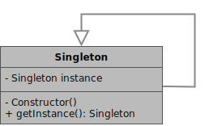
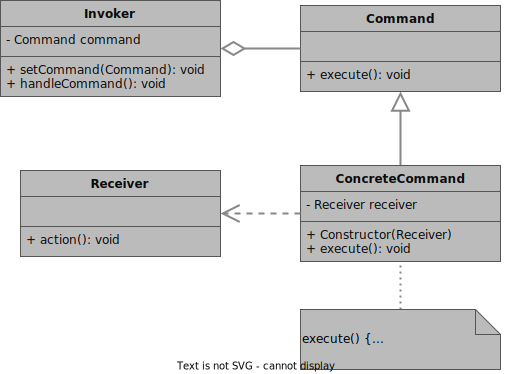
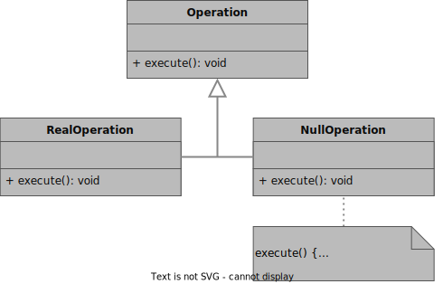

- [Design Patterns](#design-patterns)
- [Description and usage](#description-and-usage)
  - [Creational Patterns](#creational-patterns)
    - [Singleton Pattern](#singleton-pattern)
  - [Behavioral Patterns](#behavioral-patterns)
    - [Command Pattern](#command-pattern)
    - [Null Object Pattern](#null-object-pattern)
    - [TEMPLATE Pattern](#template-pattern)
- [Implementation Details](#implementation-details)
  - [Creational Patterns](#creational-patterns-1)
    - [Singleton Pattern](#singleton-pattern-1)
      - [Explanation](#explanation)
      - [UML](#uml)
  - [Behavioral Patterns](#behavioral-patterns-1)
    - [Command Pattern](#command-pattern-1)
      - [Explanation](#explanation-1)
      - [UML](#uml-1)
    - [Null Object Pattern](#null-object-pattern-1)
      - [Explanation](#explanation-2)
      - [UML](#uml-2)
    - [TEMPLATE Pattern](#template-pattern-1)
      - [Explanation](#explanation-3)
      - [UML](#uml-3)

# Design Patterns

# Description and usage

## Creational Patterns

### Singleton Pattern

- Used to ensure that **only one instance** of a singleton exists at a time
- Used to provide a (controlled) **global access** to the object

## Behavioral Patterns

### Command Pattern

- Used to make the **connection** (*Command* / request / order / call) from a **trigger** (*Invoker*) to an **executable action** (*Receiver*) a *manageable object*.

### Null Object Pattern

- Used in combination with **other patterns**
- Used to have an object **NOT doing anything** 
- Used **like a regular operation** without having to change something else

### TEMPLATE Pattern

- Used ...

# Implementation Details

## Creational Patterns

### Singleton Pattern

#### Explanation

**Singleton:**

- Make **constructor private** to prevent unwanted instantiations (-> Rule of three!)
- Make an alternative (onstructor-like) function that creates an instance of (saved in (static) member) **only if** there is none yet

#### UML

## Behavioral Patterns

### Command Pattern

#### Explanation 

**Receiver:**

- Actor whose action is performed
- Action will be called by **ConcreteCommand**
- Multiple receivers might share the same action

**Command (abstract):**

- Is managed by **Invoker**
- Interface for **ConcreteCommands**
- Decouples **ConcreteCommands** from **Invoker**

**Invoker (interface):**

- Must only know about (abstract) **Commands**!
- Handler/Trigger of of provided **ConcreteCommands**

**ConcreteCommand (implementation):**

- Implements **Command** (its *execute()*-method)
- Connection between **Invoker** and **Receiver**
- One **ConcreteCommand** per **Receiver**-method()!
    - Examplary name: make*ReceiverMethod*
    - Examplary name: *methodReceiver*

#### UML

### Null Object Pattern
(Code shown in combination with **Command** as *NullCommand*)

#### Explanation

**Operation (abstract):**

- Interface for concrete **Operation**
- Decouples concrete **Operations** from the caller

**RealOperation (implementation):**

- Implements **Operation** (its *execute()*-method)
- Does something

**NullOperation (implementation):**

- Implements **Operation** (its *execute()*-method)
- Does **nothing**

#### UML

### TEMPLATE Pattern

#### Explanation

**TEMPLATECLASSELEMENT:**

- EXPLANATION

#### UML

<!-- 
 
-->
