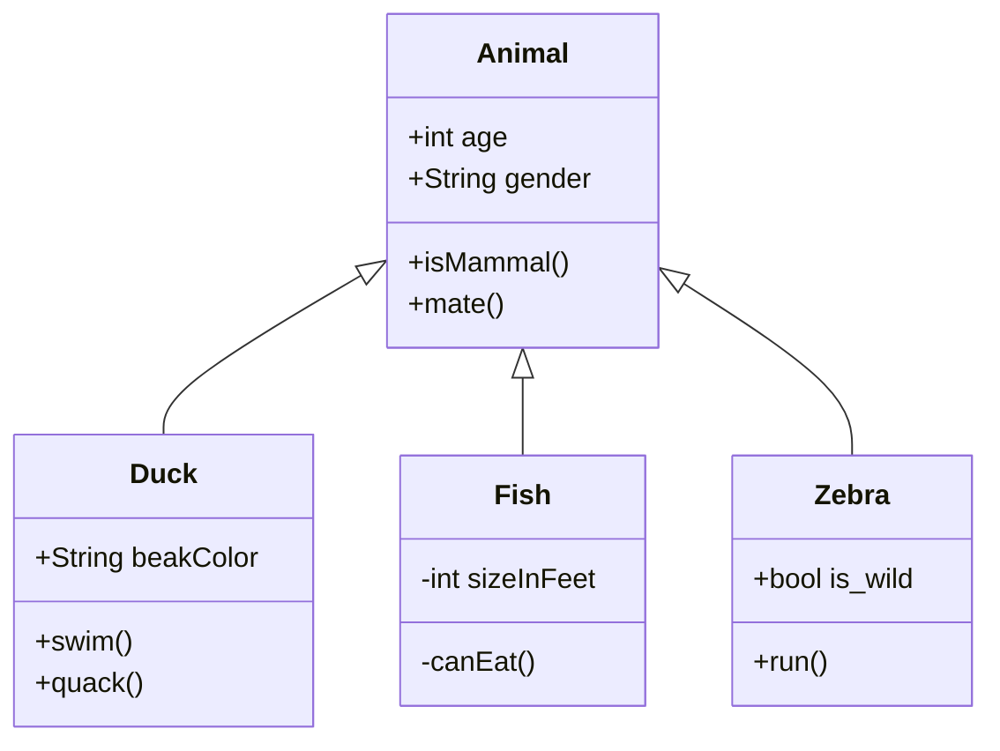

# Design Patterns

## Behavioral

### Command

#### Description

Used to make the connection between an initial trigger (**Invoker**) and an executed action (**Receiver**) a manageable object.

#### Elements:

-----

| **Receiver** |  
| :---: |
| ___ |
| + action(): *void* |

- Actor whose action is performed
- Will be called by **ConcreteCommand**

-----

| **AbstractCommand** |
| :---: |
| ___ |
| + execute(): *abstract void* |

- Provides an interface for **ConcreteCommands**
- Decouples **ConcreteCommands** from **Invoker**

-----

| **Invoker** |
| :---: |
| - Command[0...*]: *AbstractCommand*  |
| + setter( *AbstractCommand* ): *void*   + handleCommands(): *void* |

- Handler of triggering input(s) in form of provided **ConcreteCommands**
- Only knows about **AbstractCommands**!

-----

| **ConcreteCommand**   : *AbstractCommand* | 
| :---: |
| - receiver: *Receiver* |
| + Constructor( *Receiver* )   + execute(): *override void* |

        
- Connection between **Invoker** and **Receiver**
- One class per **Receiver**-method()
