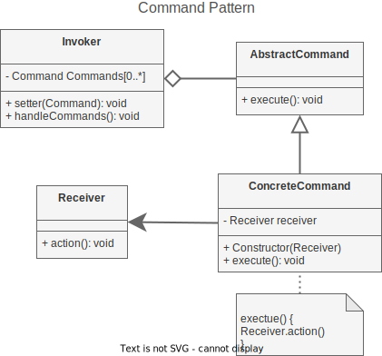
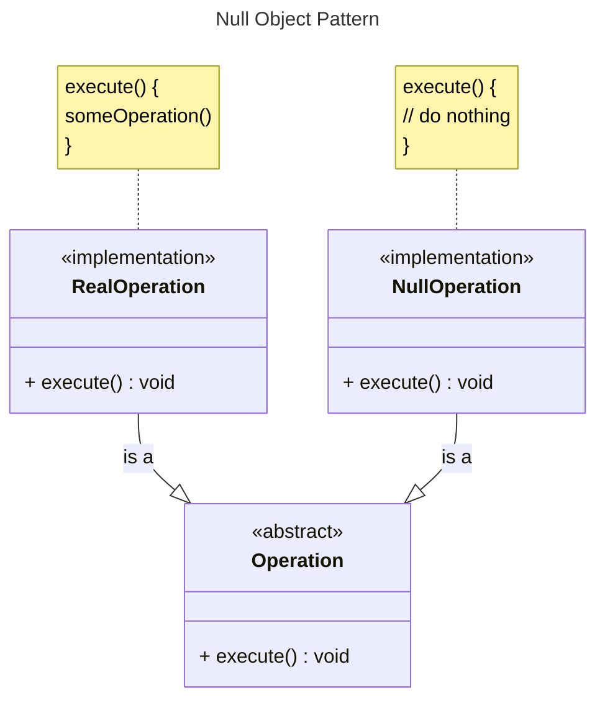

# Design Patterns

## Behavioral Patterns

### Command Pattern

#### Description

- Used to make the connection (**Command**) from a trigger (**Invoker**) to an *executable action* (**Receiver**) a *manageable object*.

- Used if *executable action* is shared by multiple **Receivers**

#### Explanation 

##### Receiver:

- Actor whose action is performed
- Action will be called by **ConcreteCommand**
- Multiple receivers might share the same action

| **Receiver** |  
| :---: |
| ___ |
| + action(): *void* |

##### Command (abstract):

- Is managed by **Invoker**
- Interface for **ConcreteCommands**
- Decouples **ConcreteCommands** from **Invoker**

| **Command** |
| :---: |
| ___ |
| + execute(): *abstract void* |

##### Invoker (interface):

- Must only know about (abstract) **Commands**!
- Handler/Trigger of of provided **ConcreteCommands**

| **Invoker** |
| :---: |
| - *Command* Commands[0...*] |
| + setter( *Command* ): *void*   + handleCommands(): *void* |

##### ConcreteCommand (implementation):

- Implements **Command** (its *execute()*-method)
- Connection between **Invoker** and **Receiver**
- One **ConcreteCommand** per **Receiver**-method()!

| **ConcreteCommand** | 
| :---: |
| - *Receiver* receiver |
| + Constructor( *Receiver* )   + execute(): *override void* |

#### UML

### Null Object Pattern
(Code shown in combination with **Command** as *NullCommand*)

#### Description

- Used in combination with **other patterns**
- Used to have an object **NOT doing anything** 
- Used **like a regular operation** without having to change something else

#### Explanation

##### Operation (abstract):

- Interface for concrete **Operation**
- Decouples concrete **Operations** from the caller

| **Operation** |
| :---: |
| ___ |
| + execute(): *abstract void* |

##### RealOperation (implementation):

- Implements **Operation** (its *execute()*-method)
- Does something

| **RealOperation** | 
| :---: |
| execute(): *override void* |

##### NullOperation (implementation):

- Implements **Operation** (its *execute()*-method)
- Does **nothing**

| **RealOperation** | 
| :---: |
| execute(): *override void* |

#### UML

