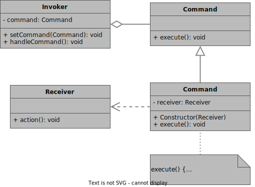
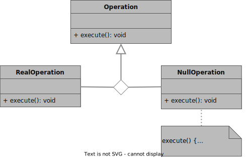

# Design Patterns

# Notable sources
(order by usage?)

- [Lukepereira - OOP Design Patterns](https://lukepereira.github.io/notebooks/documents/2020-OOP-design-patterns/index.html)
- [OO Design](https://oodesign.com)
- [Refactoring Guru](https://refactoring.guru/design-patterns)
- [Game Programming Patterns](https://gameprogrammingpatterns.com/contents.html)

# Description and usage

## Pattern Categories

### Creational Patterns **[C]**
- Provide object creation mechanisms
- Intend to increase flexibility and reusability of code

### Behavioral Patterns **[B]**
- Provide object interaction handling mechanisms
- Target assignment and responsibilities between objects

### Structural Patterns **[S]**
- Provide object assembling mechnisms into larger structures
- Intend to keep these structures flexible and efficient

## Patterns

### Singleton Pattern [C]
**General description**
- Used to ensure that **only one instance** of a singleton exists at a time
- Used to provide a (controlled) **global access** to the object

**What issue is adressed?**
- no multiple instances allowed
- global access necessary

**What can vary?**
- the sole instance of a class

### Command Pattern [B]
**General description**
- Used to make the **connection** (*Command* / request / order / call) from a **trigger** (*Invoker*) to an **executable action** (*Receiver*) a *manageable object*.

**What issue is adressed?**
- Dependency on specific operations/methods
- Tight coupling

**What can vary?**
- When and how a request is fulfilled

### Null Object Pattern [B]
**General description**
- Used in combination with **other patterns**
- Used to have an object **NOT doing anything** 
- Used **like a regular operation** without having to change something else

**What issue is adressed?**
- Check if object is not assigned (also by intention)

**What can vary?**
- The context of where it is used

### TEMPLATE Pattern [X]
**General description**
- Used ...

**What issue is adressed?**
- 

**What can vary?**
- 

# Implementation Details

## Singleton Pattern [C]

### Explanation
**Singleton:**
- Make **constructor private** to prevent unwanted instantiations (-> Rule of three!)
- Make an alternative (onstructor-like) function that creates an instance of (saved in (static) member) **only if** there is none yet

### UML

## Command Pattern [B]

### Explanation 
**Receiver:**
- Actor whose action is performed
- Action will be called by **ConcreteCommand**
- Multiple receivers might share the same action

**Command (abstract):**
- Is managed by **Invoker**
- Interface for **ConcreteCommands**
- Decouples **ConcreteCommands** from **Invoker**

**Invoker (interface):**
- Must only know about (abstract) **Commands**!
- Handler/Trigger of of provided **ConcreteCommands**

**ConcreteCommand (implementation):**
- Implements **Command** (its *execute()*-method)
- Connection between **Invoker** and **Receiver**
- One **ConcreteCommand** per **Receiver**-method()!
    - Examplary name: make*ReceiverMethod*
    - Examplary name: *methodReceiver*

### UML

## Null Object Pattern [B]
(Code shown in combination with **Command** as *NullCommand*)

### Explanation
**Operation (abstract):**
- Interface for concrete **Operation**
- Decouples concrete **Operations** from the caller

**RealOperation (implementation):**
- Implements **Operation** (its *execute()*-method)
- Does something

**NullOperation (implementation):**
- Implements **Operation** (its *execute()*-method)
- Does **nothing**

### UML

## TEMPLATE Pattern [X]

### Explanation
**TEMPLATECLASSELEMENT:**
- EXPLANATION

### UML
<!-- 
 
-->

